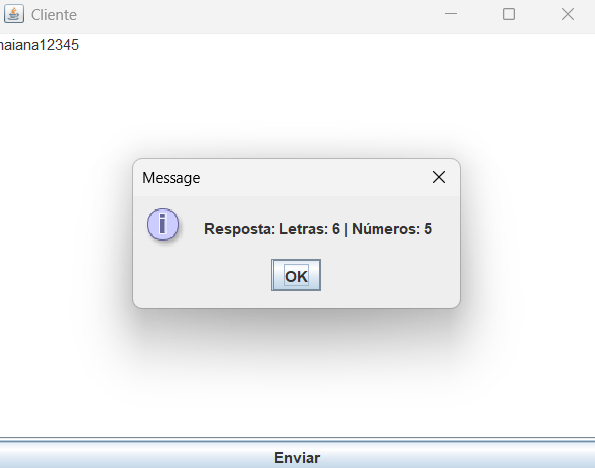

# Sistema-Distribuido-Mestre-Escravo
 Trabalho para a disciplina de sistemas distribuidos


Este sistema utiliza uma arquitetura mestre-escravo, onde um **cliente** envia um texto ao **mestre**, que por sua vez distribui tarefas para dois **escravos**. Um responsável por contar letras e outro por contar números. Toda a comunicação é realizada por meio de **requisições HTTP** e pode ser executada em **containers Docker**.

## Fluxo de Execução

1. **Envio do Texto pelo Cliente**
   - O cliente envia uma requisição HTTP POST para o mestre, no endpoint /processar.
   - O corpo da requisição contém o texto a ser analisado.

2. **Verificação de Disponibilidade dos Escravos**
   - O mestre envia requisições HTTP GET para o endpoint ping dos dois escravos:
     - Escravo de letras: `http://escravo-letras:8001/ping`
     - Escravo de números: `http://escravo-numeros:8002/ping`
   - Se ambos retornarem status `200 OK`, o mestre prossegue com o processamento, caso algum esteja indisponível, o mestre retorna ao cliente uma resposta com:
     - **Status:** `503 Serviço Indisponível`
     - **Mensagem:** Informando que um ou mais escravos estão inativos.

3. **Processamento Paralelo**
   - O mestre utiliza `ExecutorService` e `Future` para enviar o texto aos endpoints:
     - /letras para o escravo de letras.
     - /numeros para o escravo de números.
   - Cada escravo processa o texto separadamente:
     - **Escravo de Letras:** Conta todos os caracteres alfabéticos usando `Character::isLetter`.
     - **Escravo de Números:** Conta os dígitos de 0 a 9 usando `Character::isDigit`.

4. **Consolidação dos Resultados**
   - O mestre recebe os resultados dos escravos e monta uma resposta final no formato:
     
     Letras: X | Números: Y
     
     Substituindo `X` e `Y` pelas contagens reais. Assim a resposta é enviada de volta ao cliente com **status `200 OK`**.

5. **Registro e Monitoramento**
   - Todo o processo (incluindo falhas e sucessos) é registrado no terminal do servidor mestre.

   **▶️EXECUÇÃO DO PROJETO**

   Para executar o sistema foi executando no servidor os comandos `docker compose up --buil` e `docker compose up`.
    - O docker compose up --build Gera as imagens docker com base nos arquivos Dockerfile de cada componente.
    - O docker compose up sobe os containers automaticamente após a build e após a construção inicial foi utilizado somente ele. 

    -Além disso, para a utilização da linguagem java é preciso realizar a instalação do java JDK na máquina.

## 📁 ESTRUTURA DO PROJETO

```bash
/projeto-distribuido/
├── cliente-gui/ 
│   └── Cliente.java
├── mestre/                            
│   └── Mestre.java                     
├── escravo-letras/                     
│   └── EscravoLetras.java             
├── escravo-numeros/                    
│   └── EscravoNumeros.java             
├── docker-compose.yml                 
├── README.md                           
└── LICENSE                             

```
## 📷 IMAGENS DAS EXECUÇÕES





